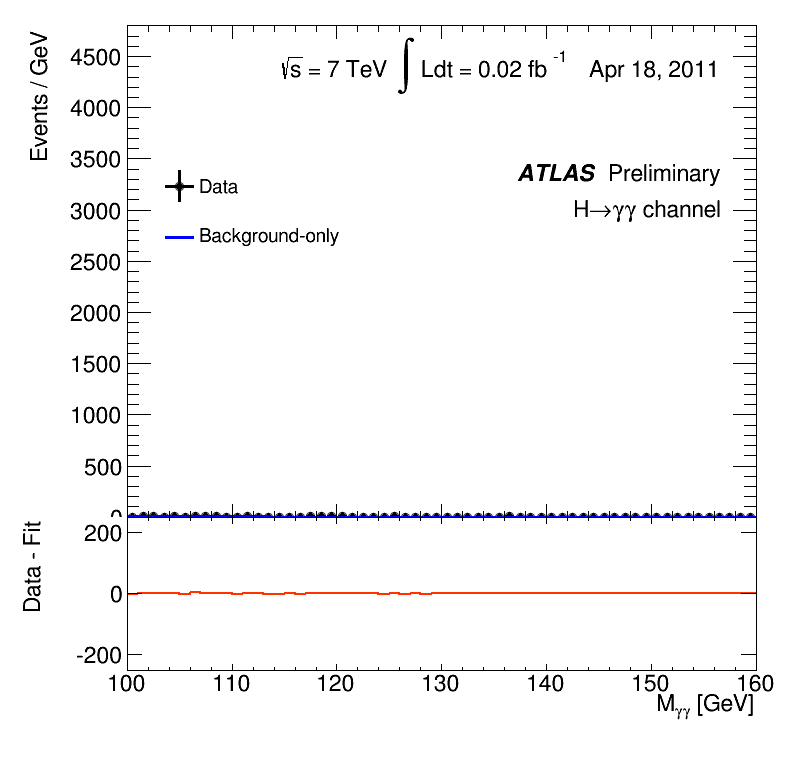

# Colour by Mass 

A dynamic installation representing Higgs data &mdash; specifically the boson's transformations to photons &mdash; as colours

<!-- START doctoc generated TOC please keep comment here to allow auto update -->
<!-- DON'T EDIT THIS SECTION, INSTEAD RE-RUN doctoc TO UPDATE -->
**Table of Contents**  *generated with [DocToc](https://github.com/thlorenz/doctoc)*

- [The Higgs boson](#the-higgs-boson)
  - [Visualising two photons](#visualising-two-photons)
- [Technical details](#technical-details)
- [FAQ](#faq)

<!-- END doctoc generated TOC please keep comment here to allow auto update -->

## The Higgs boson

Discovered in 2012 by the [CMS](http://cms.web.cern.ch) and [ATLAS](http://atlas.ch) collaborations at [CERN's Large Hardon Collider](http://home.cern/topics/large-hadron-collider), the Higgs boson is a particle associated with the phenomenon that gives mass to all fundamental particles.
One of the ways in which the Higgs can be observed is through its transformation or *[decay](https://en.wikipedia.org/wiki/Particle_decay)* into two photons, the particles of light (see image below).
This is known as the "di-photon" decay channel.

> Proton-collision event recorded with the CMS detector in 2012 at a centre-of-mass energy of 8 TeV.
The event shows characteristics expected from the decay of the Standard-Model Higgs boson to a pair of photons (dashed yellow lines and green towers).
> - **Image credit**: Thomas McCauley ([@tpmccauley](https://github.com/tpmccauley)) and Lucas Taylor
> - **Copyright**: [CERN](http://home.cern), for the benefit of the CMS Collaboration
> - **Licence**: [CC BY-SA-4.0](http://creativecommons.org/licenses/by-sa/4.0/) 
> - **Source**: https://cds.cern.ch/record/1606503

### Visualising two photons

The correct way to visualise Higgs transformations to photons is like this:

> - **Copyright**: [CERN](http://home.cern), for the benefit of the ATLAS Collaboration
> - **Source**: https://twiki.cern.ch/twiki/pub/AtlasPublic/HiggsPublicResults//Hgg-FixedScale-Short2.gif

What you are seeing is a build-up of "di-photon" data represented as a histogram.
Two photons can be produced from a number of (background) processes and so you would expect a falling slope in your histogram.
However, at a mass of around 125 GeV, you see a statistically significant, albeit slight, bump in the data.
This bump, which rises above the background expectation, shows photons that may have emerged from a Higgs boson.

Now, since photons are the particles of light (or, to be precise, the particles associated with electromagnetic radiation), this project uses the rather tenuous connection of "photons &rarr; light &rarr; colour" to produce a dynamic piece of art.
In this piece, the energies of each photon from the "di-photon" system are associated with specific values from the visible electromagnetic spectrum.

[…]

## Technical details

The project is built using [D3.js] and relies on open data from the CMS Collaboration, available on the [CERN Open Data Portal](http://opendata.cern.ch).
The di-photon data used in this specific piece are extracted from […] using […], and can be found at […].

## FAQ

- **Q1**: If you are talking about mass of the Higgs boson, why do you refer to the energies of the photons?
> **A1**: […]
